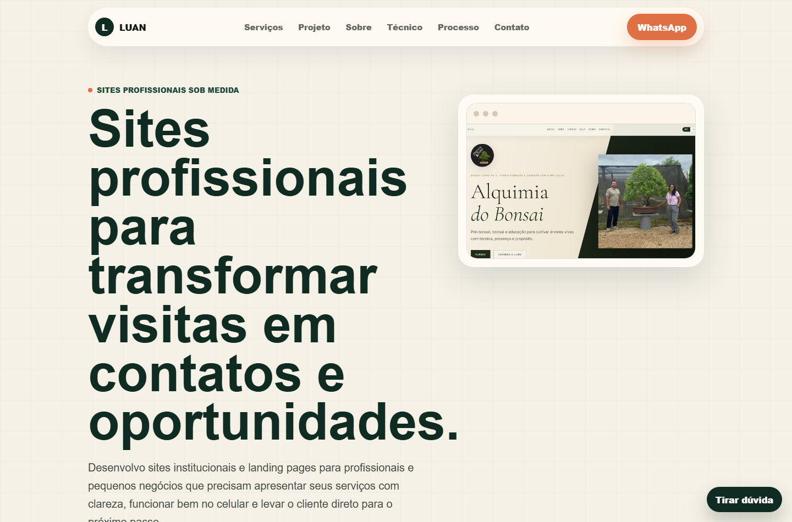

# portfolio-luan-salles

Portfólio profissional de Luan Salles, desenvolvido para apresentar serviços de criação de sites institucionais, landing pages e sistemas web para profissionais e pequenos negócios.



## Site publicado

[portfolio-luan-one.vercel.app](https://portfolio-luan-one.vercel.app/)

## Sobre o projeto

Este portfólio foi criado com foco comercial: apresentar de forma clara o que Luan desenvolve, para quem o serviço é indicado, como funciona o processo de contratação e quais projetos já foram construídos.

O site inclui:

- apresentação dos serviços principais;
- estudo de caso do projeto Alquimia do Bonsai;
- demonstração sanitizada do FuteGestão CT com dados fictícios;
- seção sobre o desenvolvedor;
- área técnica para recrutadores e parceiros;
- FAQ com dúvidas comuns sobre domínio, hospedagem, conteúdo e revisões;
- chamada para formulário de proposta e contato por WhatsApp.

## O que desenvolvi

- Estrutura e implementação da página principal.
- Layout responsivo para desktop e celular.
- Organização da copy comercial.
- Seções de serviços, estudo de caso, sobre, processo, tecnologias, FAQ e contato.
- Integração com Google Forms para solicitação de proposta.
- Mensagem pré-preenchida para contato via WhatsApp.
- Imagem de preview para apresentação do projeto no GitHub.

## Tecnologias utilizadas

- React
- TypeScript
- Vinext
- Next.js
- CSS
- Vite
- Vercel

## Como executar localmente

Pré-requisito:

- Node.js `>=22.13.0`

Instale as dependências:

```bash
npm install
```

Execute em desenvolvimento:

```bash
npm run dev
```

Gere a build de produção:

```bash
npm run build
```

## Estrutura principal

```text
app/
  layout.tsx
  page.tsx
  globals.css
public/
  alquimia-bonsai-desktop.png
docs/
  portfolio-preview.png
site/
  index.html
  favicon-ls.svg
  luan-salles.jpeg
  alquimia-bonsai-desktop.png
```

## Deploy

O projeto publicado utiliza Vercel. A configuração em `vercel.json` publica a pasta `site/`, que contém a versão estática do portfólio.

Depois de conectar o repositório à Vercel, novos commits na branch principal geram uma nova publicação automaticamente.

## Observações

O projeto Alquimia do Bonsai é apresentado como estudo de caso. O link público foi removido temporariamente do portfólio enquanto o projeto passa por revisão de segurança e conteúdo.

O FuteGestão CT é apresentado com dados fictícios para preservar informações privadas.
