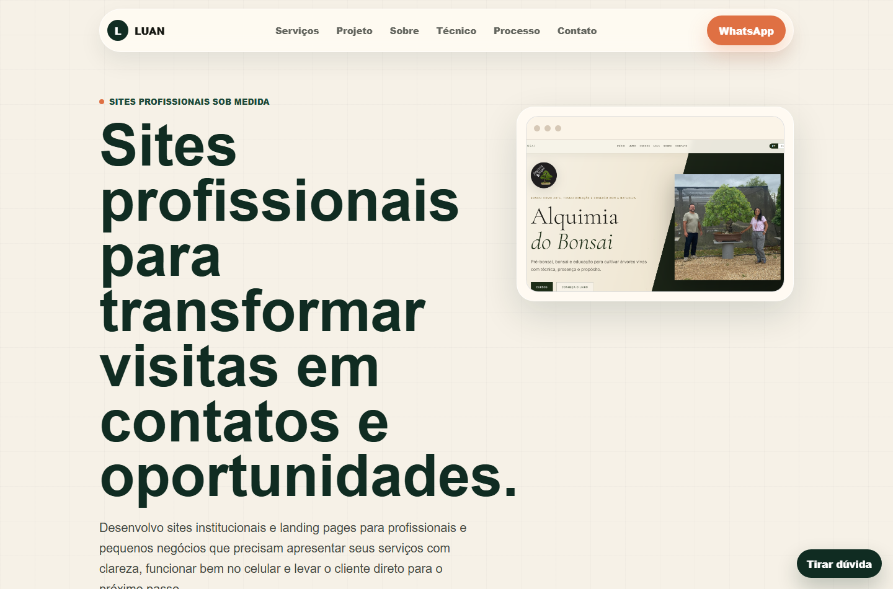

# portfolio-luan-salles

Portfólio profissional de Luan Salles para apresentar serviços de desenvolvimento web com foco em sites institucionais, landing pages e melhorias em sites existentes.



## Site publicado

[portfolio-luan-one.vercel.app](https://portfolio-luan-one.vercel.app/)

## Objetivo

O projeto foi criado para ajudar possíveis clientes a entenderem rapidamente:

- que tipo de site podem contratar;
- como funciona o processo de criação;
- quem é o desenvolvedor responsável;
- qual trabalho real já foi publicado;
- como entrar em contato pelo WhatsApp ou por briefing.

## Projeto em destaque

O principal estudo de caso é o site da Alquimia do Bonsai:

[alquimiadobonsai.com](https://alquimiadobonsai.com)

O case apresenta o problema, a solução, o resultado e uma demonstração interativa do site publicado. O projeto reúne versão em português e inglês, catálogo, favoritos, carrinho local, páginas institucionais, cursos, vídeos, links externos e contato via WhatsApp.

## O que desenvolvi

- Estrutura e implementação da página principal.
- Layout responsivo para desktop e celular.
- Conteúdo comercial focado em sites para pequenos negócios e profissionais.
- Estudo de caso do projeto Alquimia do Bonsai.
- Bloco técnico complementar com FuteGestão CT.
- Seção sobre Luan Salles.
- Processo de contratação em três etapas.
- FAQ com dúvidas comuns.
- Contato por WhatsApp com mensagem pronta.
- Link para briefing no Google Forms.
- Alternância de conteúdo em português e inglês.
- Metadados, favicon, Open Graph e JSON-LD.

## Tecnologias

- Next.js
- React
- TypeScript
- CSS
- JavaScript
- Vercel

## Como executar localmente

Pré-requisito:

- Node.js `>=22.13.0`

Instale as dependências:

```bash
npm install
```

Execute em desenvolvimento:

```bash
npm run dev
```

Gere a versão estática usada no deploy:

```bash
node scripts/generate-static-site.mjs
```

Gere a build de produção:

```bash
npm run build
```

## Estrutura principal

```text
app/
  layout.tsx
  page.tsx
  globals.css
scripts/
  generate-static-site.mjs
public/
  favicon-ls.svg
  luan-salles.jpeg
  alquimia-bonsai-1180.jpg
  alquimia-bonsai-760.jpg
docs/
  portfolio-preview.png
site/
  index.html
```

## Deploy

O projeto publicado utiliza Vercel. A configuração em `vercel.json` publica a pasta `site/`, que contém a versão estática gerada do portfólio.

Depois de conectar o repositório à Vercel, novos commits na branch principal geram uma nova publicação automaticamente.
